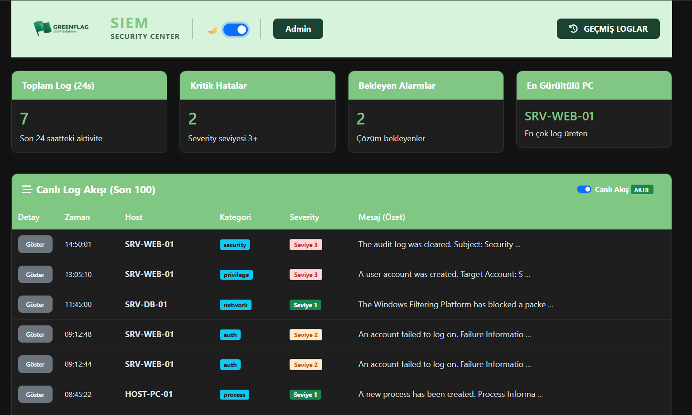
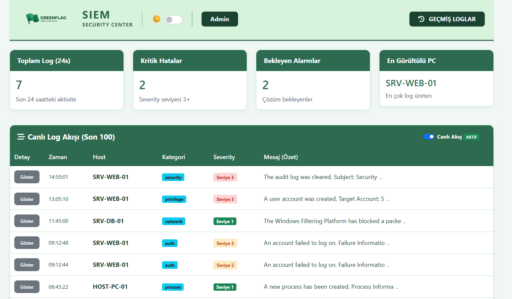
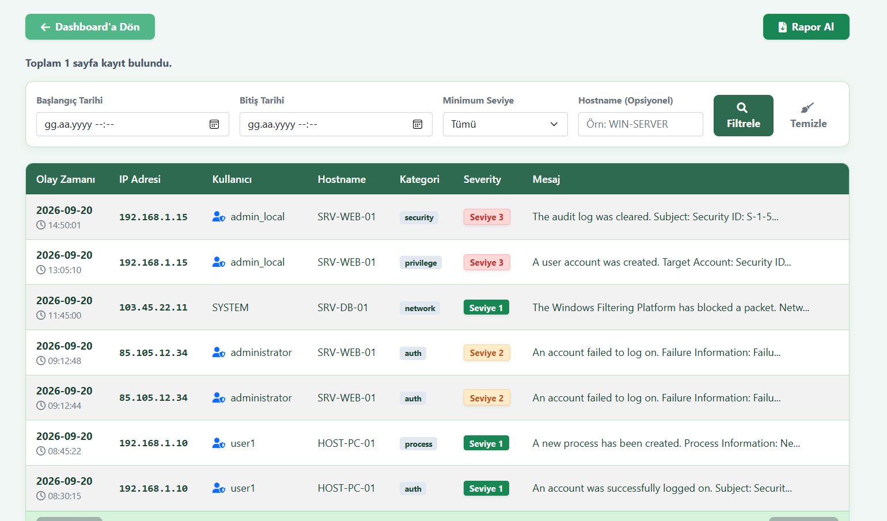
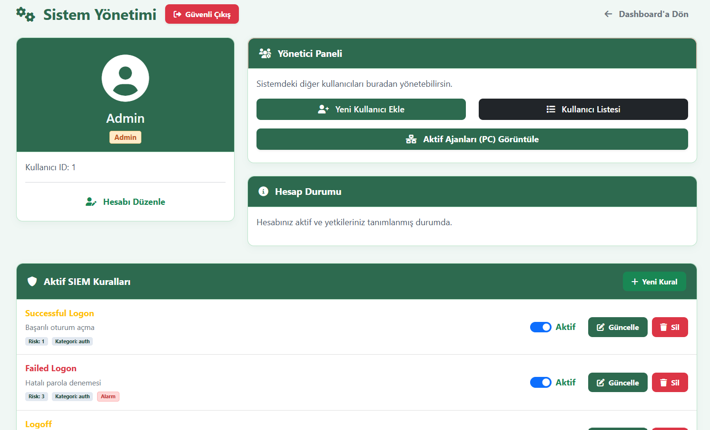
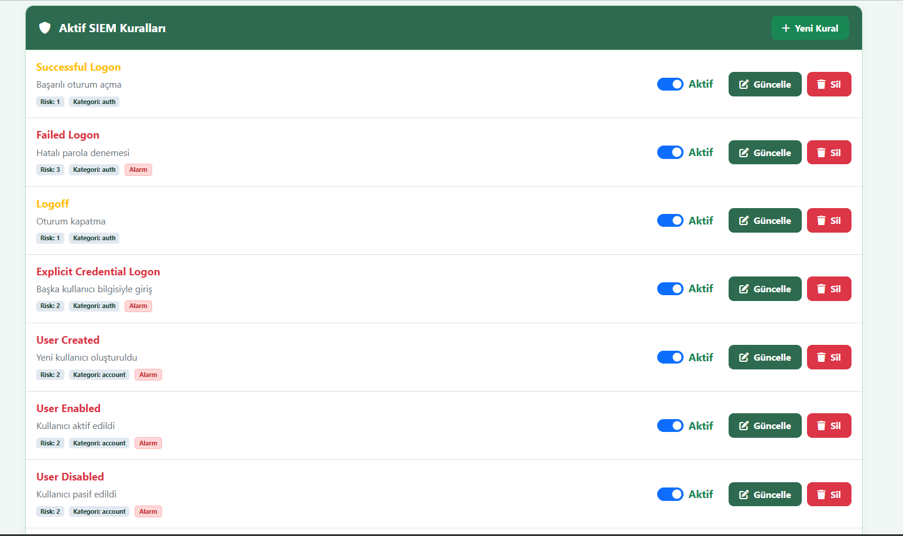
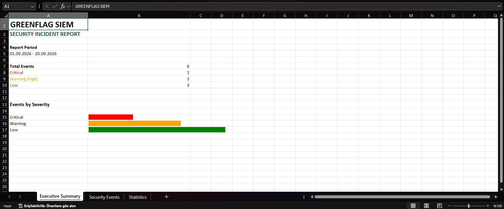
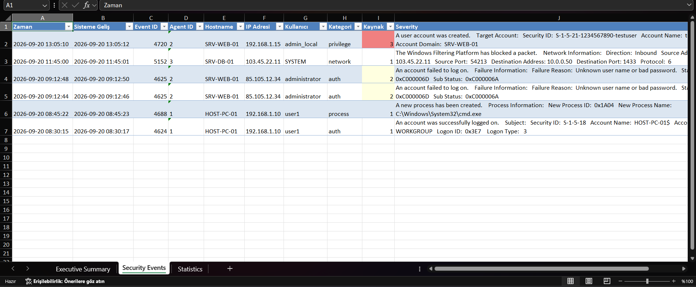
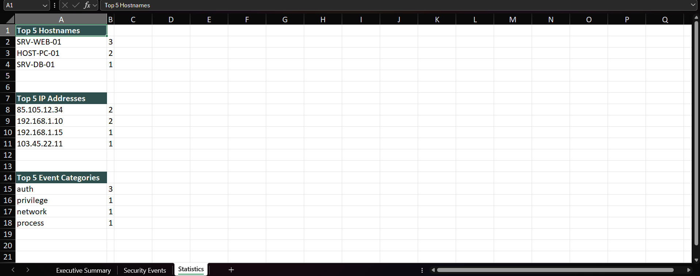

# GreenFlag-SIEM    
GreenFlag is a lightweight SIEM solution developed with C#. Its modular architecture is designed to make the system easy to extend, improve, and integrate with new components over time.
## 📸 System Showcase

### 🎨 UI Themes & Dashboard
| Dashboard (Dark Mode) | Dashboard (Light Mode) |
|:---:|:---:|
|  |  |

### 🔍 Log Monitoring & Management
| Log History & Filtering | System Management Panel |
|:---:|:---:|
|  |  |

### 🛡️ Rules & Executive Reporting
| Rule Management & Alerts | Executive Summary (Excel) |
|:---:|:---:|
|  |  |

### 📊 Detailed Excel Analytics
| Security Events Data | Report Statistics |
|:---:|:---:|
|  |  |

## Overview

GreenFlag is a lightweight SIEM solution developed with C#. The project focuses on collecting, processing, storing, and monitoring security-related log data through a modular architecture.

The current version collects Windows Event Logs directly from the Windows Event Viewer system, processes them through the GreenFlag Agent and Ingestor, stores them in SQL Server, and presents the collected data through a web-based management interface.

GreenFlag is currently under active development. The current implementation provides the core log collection, processing, storage, monitoring, and reporting pipeline, while several advanced SIEM capabilities are still being developed.

## Vision & Roadmap

The long-term goal of GreenFlag is to evolve into a more complete and extensible SIEM platform.

Planned improvements include:

* Developing a dedicated endpoint agent for more flexible and advanced log collection
* Implementing an event correlation engine to identify relationships between multiple events
* Expanding detection and alerting capabilities
* Improving incident investigation and management
* Adding multi-platform support, including Linux
* Expanding endpoint monitoring capabilities
* Developing more advanced reporting and analytics

The project is designed with a modular architecture so that these capabilities can be introduced progressively without requiring a complete redesign of the existing system.

## 1. General Architecture

GreenFlag consists of three main components:
```text
Windows Event Log (WEL)
        │
        ▼
GreenFlag Agent
        │
        │ UDP / JSON
        ▼
GreenFlag Ingestor
        │
        ├── Agent Memory
        ├── Log Queue
        ├── Rule Memory
        ├── Heartbeat Queue
        ├── SQL Worker
        ├── Heartbeat Worker
        └── Log Doctor
        │
        ▼
SQL Server
        ▲
        │
GreenFlag Web
```
The Web application does not communicate directly with the Ingestor. It connects directly to SQL Server.

## 2. GreenFlag Agent

The Agent runs on Windows endpoints and collects events from Windows Event Log (WEL).

### 2.1 Event Tracking Through WEL

At startup, the Agent connects to WEL and checks the existing event records.

It uses the latest processed EventRecordId as its reference point.

Instead of reading the entire event history every time it starts, the Agent continues monitoring from the point it tracks.

For example:
```text
Last processed EventRecordId: 500

New records:
501
502
503
504
...
```
The Agent continues processing new records from this point.

EventRecordId is different from the Windows Event ID.

For example:
```text
EventRecordId = 500
EventId       = 4624
```
### 2.2 ILogChannel Architecture

The Agent manages different Windows event sources through separate channels.

These channels are created through the ILogChannel interface.

The main channels currently include:

Security
Application
System

This allows different Windows Event Log sources to be processed independently.

### 2.3 Event Parsing

The Agent does not send raw Windows event data directly to the Ingestor.

Events are first processed through the IEventParser architecture.

The parser converts raw Windows event data into a structured format that can be used by GreenFlag.

Different event types are handled through ParserFactory.

For example:
```text
Raw Windows Event
        │
        ▼
IEventParser
        │
        ▼
ParserFactory
        │
        ├── Security Parser
        ├── Application Parser
        └── System Parser
        │
        ▼
Structured Event
```
The parser extracts and organizes relevant information from the event.

The Agent also processes event messages and machine information while handling the records.

### 2.4 Waiting for New Events

The Agent does not continuously poll WEM without delay when there are no new events.

If no new event is available or an appropriate operation cannot be performed, the Agent waits for approximately:

5 seconds

before checking again.

This reduces unnecessary CPU usage caused by continuous polling.

### 3. UDP Sender

Logs collected by the Agent are stored as Event_Paket objects.

The UDP sender groups multiple events into a list before transmission.

For example:
```text
Event_Paket List

[Log1]
[Log2]
[Log3]
...
```
A packet is sent when either:

The packet reaches its configured capacity.
The configured time interval expires.

This allows multiple logs to be transmitted together instead of sending every event individually.

The transmission flow is:
```text
Event_Paket List
        ↓
JSON Serialization
        ↓
UDP
        ↓
Ingestor
```
### 4. Agent Local IP Address

The Agent determines its local IP address using GetLocalIPAddress.

This information is included in the Agent's heartbeat data and sent to the Ingestor.

### 5. Agent Heartbeat

The Agent periodically sends heartbeat information.

Heartbeats are transmitted over UDP in JSON format.

Heartbeat data contains information required to identify and monitor the Agent, such as:

Agent ID
Username
IP Address
Hostname
Other Agent status information

The general flow is:
```text
Agent
  │
  ▼
Heartbeat Object
  │
  ▼
JSON Serialization
  │
  ▼
UDP
  │
  ▼
Ingestor
```
## 6. GreenFlag Ingestor

The Ingestor is the central data processing component of GreenFlag.

It receives logs and heartbeat information from Agents over UDP, processes the incoming data, queues it, and forwards the processed data to SQL Server.

### 7. UDP Server

The Ingestor operates as a UDP server.

A buffer of approximately:

64 MB

is allocated for the UDP listener.

The UDP socket is also handled in a way that helps prevent Windows-side socket and port issues when the remote endpoint is not actively listening on the corresponding UDP port.

### 8. Incoming Packet Processing

The Ingestor processes incoming UDP packets through its main processing loop.

The basic flow is:
```text
UDP Packet
    ↓
JSON Deserialization
    ↓
Event_Paket List
    ↓
Log Validation
    ↓
Log Queue
```
If JSON deserialization fails:

The invalid packet is counted.

The error information is recorded.

The error is printed to the console.

Processing continues.

The goal is to prevent a single malformed JSON packet from causing the entire Ingestor to stop.

### 9. Incoming Log Count

The Ingestor keeps track of the total number of incoming logs in memory.

For example:

Interlocked.Add(ref IncomingLogCount, paketler.Count);

This allows the incoming log counter to be updated in a thread-safe manner.

The counter is later used by system statistics and LogDoctor.

### 10. Log Queue

Incoming logs are placed into LogKuyruk.

The current maximum queue capacity is:

100,000 logs

This prevents the Ingestor from consuming unlimited amounts of memory under heavy load.

### 11. Load Protection and Log Dropping

When the queue reaches its maximum capacity, logs are not treated equally.

The Ingestor first checks whether a rule exists for the incoming event.

For example:
```text
if (KuralHafizasi.TryGetValue(log.event_id, out KuralBilgisi kural))
{
    anlikSeverity = kural.Severity;
    kuralvar = true;
}
```
When the queue is full, the system can drop lower-priority logs:
```text
if (LogKuyruk.Count >= kuyrukLimit &&
    (!kuralvar || anlikSeverity <= 1))
{
    Interlocked.Increment(ref DroppedQueueCount);
    continue;
}
```
The purpose of this mechanism is to protect the system under heavy load.

In simplified form:
```text
Queue Full
   │
   ├── Low-priority log → DROP
   │
   └── Important log → KEEP
```
Dropped logs are counted separately.

This allows the system to protect more important events instead of allowing queue growth to consume unlimited resources.

### 12. Heartbeat Queue

Incoming heartbeat data is not written directly to SQL Server.

Instead, heartbeat information is placed into a separate queue.

The HeartbeatWorker later processes this queue.

This prevents the UDP listener from being blocked by database operations.

### 13. Agent Memory

The Ingestor keeps track of Agent information received from logs and heartbeats.

Information such as:

* Agent ID
* Username
* IP Address
* Hostname

can be stored in memory.

This information can later be used to enrich incoming logs before they are written to SQL Server.

For example, a log may only contain:

Hostname = HOST-PC-01

The Ingestor can use its Agent information to enrich the log with:

* AgentId
* Username
* IP Address

### 14. Main Async Task

The main Ingestor task operates asynchronously.

Its responsibilities include:

* Loading rules
* Listening for UDP traffic
* Receiving logs
* Adding logs to the queue
* Receiving heartbeat data
* Running worker components
* Tracking system statistics

The main task also runs:

* SQLWorker
* HeartbeatWorker
* LogDoctor

### 15. SQL Worker

The SQLWorker is responsible for moving logs from the Log Queue to SQL Server.

The worker retrieves a certain number of logs and creates a batch.

The current implementation processes approximately:

100 logs per batch.

For example:
```text
Log Queue
   ↓
100 Logs
   ↓
Batch List
   ↓
DB Write
```
As long as the batch contains logs, the worker processes them and sends them to the database.

After the batch is processed, it is cleared.

If there are not enough logs available, the worker waits for a period of time and checks again.

Any SQL worker error is printed to the console.

### 16. DB Write

The database writing stage receives an Event_Paket list and converts it into a list suitable for SQL insertion.

If the list is empty or contains zero logs, the operation returns immediately.

#### 16.1 Default Severity

During processing, each incoming log initially receives:

Severity = 1

The rule memory is then checked to determine whether the event should receive a different severity.

#### 16.2 Category

The log's category is checked during processing.

If the category is empty, it is set to:

Unknown

#### 16.3 Hostname

The hostname is also checked.

If no hostname is available, it is left empty.

### 17. Rule Memory

The Ingestor loads detection rules from SQL Server and keeps them in memory.

The rules can be represented conceptually as:
```text
Event ID
    ↓
Rule Information
    ↓
Severity
Category
```
During database processing, the incoming event's event_id is compared against the rules stored in KuralHafizasi.

If a matching rule exists:

* Severity is updated.
* Category is updated.

This allows incoming logs to be enriched according to the currently configured rules before they are stored in SQL Server.

18. Log Enrichment

During the database write stage, additional information is added to incoming logs.

The Agent information is retrieved using the hostname.

For example:
```text
Hostname
    ↓
GetOrFetchAgentInfoAsync()
    ↓
Agent Status / Agent Memory
    ↓
AgentId
Username
IP Address
```
For example:
```text
if (!string.IsNullOrEmpty(hostname))
{
    var agentInfo = await GetOrFetchAgentInfoAsync(hostname, conn);

    if (agentInfo != null)
    {
        agentIdObj = agentInfo.AgentId;

        if (!string.IsNullOrEmpty(agentInfo.UserName))
            userNameObj = agentInfo.UserName;

        if (!string.IsNullOrEmpty(agentInfo.IpAddress))
            ipObj = agentInfo.IpAddress;
    }
}
```
This allows the Ingestor to enrich the basic event data received from the Agent with additional Agent information.

### 19. SQL Log Record Creation

After rule processing and enrichment, the remaining log information is added.

Depending on the event, this can include:

* Event time
* Event ID
* Agent ID
* Hostname
* Username
* IP Address
* Category
* Source
* Severity
* Message
* Ingest time
* Other event information

The processed logs are then written to SQL Server in bulk.

### 20. Bulk SQL Insert

Logs are not inserted into SQL Server one by one.

Instead, they are processed and written in batches.

This helps:

* Reduce database round trips
* Reduce SQL Server overhead
* Improve throughput under high log volume

The general flow is:
```text
Queue
 ↓
Batch
 ↓
Processing
 ↓
Enrichment
 ↓
Bulk Insert
 ↓
SQL Server
```
### 21. Rule Loading

The Ingestor periodically checks SQL Server for updated rules.

New or modified rules are loaded into KuralHafizasi.

This allows rule changes to affect log processing without requiring the Ingestor to be restarted.

The general flow is:
```text
SQL Server Rules
       ↓
Load Rules
       ↓
Rule Memory
       ↓
Incoming Logs
       ↓
Severity / Category
```
### 22. Agent Status / GetOrFetchAgentInfoAsync

Agent information is stored in the AgentStatuses table in SQL Server.

GetOrFetchAgentInfoAsync retrieves the required Agent information from SQL Server or uses the information already available in memory.

Tracked information can include:

* Agent ID
* Hostname
* Username
* IP Address
* Heartbeat information
* Last known Agent status

This information is used both for Agent monitoring and log enrichment.

### 23. Heartbeat Worker

The HeartbeatWorker processes heartbeat data received over UDP.

Heartbeat information is written to:

AgentStatuses

in SQL Server.

The flow is:
```text
Agent
 ↓
Heartbeat
 ↓
UDP
 ↓
Heartbeat Queue
 ↓
HeartbeatWorker
 ↓
AgentStatuses
```
If an error occurs during processing, the error is printed to the console.

### 24. Agent Status Updates

Heartbeat information allows the current Agent information to be maintained in SQL Server.

For example:
```text
Agent
 ├── AgentId
 ├── Hostname
 ├── Username
 ├── IP Address
 └── Last Heartbeat
```
This information also provides the foundation for Agent monitoring in the Web application.

### 25. InsertStat / System Statistics

The Ingestor records system-level statistics in SQL Server.

Tracked statistics can include:

* Incoming log count
* Dropped log count
* Invalid JSON count
* Traffic information
* System processing statistics

These statistics can later be used for monitoring and analysis.

### 26. LogDoctor

LogDoctor is responsible for monitoring the health of the log processing pipeline.

It periodically checks the current state of the system.

It can monitor:

* Logs dropped from the queue
* Logs lost because of invalid JSON
* Total incoming logs
* Total traffic
* Dropped/lost data
* Loss rate

The loss rate is calculated based on the total incoming traffic and recorded accordingly.

The results are also printed to the console.

For example:

* Incoming Logs
* Dropped Logs
* Invalid JSON
* Total Traffic
* Loss Rate

can be monitored.

### 27. Error Handling

GreenFlag uses basic fault isolation throughout the Agent and Ingestor pipeline.

The goal is to prevent a single:

* Malformed JSON packet
* Invalid UDP packet
* SQL error
* Worker error
* Parser error
* Unexpected event

from terminating the entire system.

Errors are handled by the relevant component, logged to the console, and processing continues whenever possible.

In particular, JSON deserialization errors are counted separately so that packet loss can be monitored.

## 28. GreenFlag Web

The Web application is the visual and management layer of GreenFlag.

An important architectural detail is:

The Web application does not communicate directly with the Ingestor.

The Web application connects directly to SQL Server:
```text
GreenFlag Web
      │
      ▼
SQL Server
```
The Ingestor follows a separate pipeline:
```text
Agent
  ↓
UDP
  ↓
Ingestor
  ↓
SQL Server
```
### 29. Web Features

The Web application uses the data stored in SQL Server to provide:

* Log viewing
* Log filtering
* Log history
* Rule management
* User management
* Agent information
* Reporting
* Statistics
* Monitoring functionality

## 30. Complete Data Flow

The complete GreenFlag architecture can be summarized as:
```text
┌──────────────────────────┐
│ Windows Event Manager    │
│ Security / Application / │
│ System                   │
└────────────┬─────────────┘
             │
             ▼
┌──────────────────────────┐
│ GreenFlag Agent          │
│                          │
│ EventRecord Tracking     │
│ ILogChannel              │
│ IEventParser             │
│ ParserFactory            │
│ Event_Paket              │
│ UDP Sender               │
│ Heartbeat                │
└────────────┬─────────────┘
             │
             │ UDP / JSON
             ▼
┌──────────────────────────┐
│ GreenFlag Ingestor       │
│                          │
│ UDP Server               │
│ JSON Processing          │
│ Agent Memory             │
│ Rule Memory              │
│ Log Queue                │
│ Heartbeat Queue          │
│                          │
│ ┌──────────────────────┐ │
│ │ SQLWorker            │ │
│ │ HeartbeatWorker      │ │
│ │ LogDoctor            │ │
│ └──────────────────────┘ │
└────────────┬─────────────┘
             │
             │ Batch / Bulk
             ▼
┌──────────────────────────┐
│ SQL Server               │
│                          │
│ Logs                     │
│ AgentStatuses            │
│ Rules                    │
│ System Statistics        │
│ Users                    │
└────────────┬─────────────┘
             │
             ▼
┌──────────────────────────┐
│ GreenFlag Web            │
│                          │
│ Monitoring               │
│ Log Management           │
│ Rule Management          │
│ User Management          │
│ Reporting                │
│ Statistics               │
└──────────────────────────┘
```
## 31. Current Technical Capabilities

Based on the current architecture, GreenFlag can currently perform:

* Windows Event Manager event collection
* Event tracking using EventRecordId
* Security, Application, and System log collection
* Parser-based event processing
* Parser selection through ParserFactory
* UDP-based log transmission
* JSON-based packet serialization
* Batched log transmission
* Agent heartbeat transmission
* Agent information tracking
* Centralized UDP-based log ingestion
* JSON error detection and counting
* A 100,000-log queue capacity
* Load protection through selective low-priority log dropping
* Protection of higher-priority logs under queue pressure
* Rule memory
* Dynamic rule loading
* Severity and category enrichment
* Agent information enrichment
* Asynchronous worker-based processing
* Batch SQL processing
* Bulk SQL insertion
* Agent status monitoring
* System statistics
* Log pipeline health monitoring
* Loss-rate tracking
* Web-based log monitoring
* Log filtering
* Rule management
* User management
* Excel reporting
* Basic event statistics and analysis

## 32. Future Development Direction

The current GreenFlag architecture is more than a simple:

Event Log → Database

application.

The Agent provides event collection and parsing, while the Ingestor provides UDP ingestion, queue management, rule processing, enrichment, worker-based processing, load protection, and pipeline monitoring.

Future development can build additional SIEM capabilities on top of this architecture, including:

* Event correlation engine
* More advanced detection capabilities
* Alert management
* Incident management
* Advanced endpoint telemetry
* Further development of the Agent for more flexible endpoint data collection
* Linux Agent
* Multi-platform endpoint support
* Advanced analytics
* More advanced reporting

The project is designed around a modular architecture so these capabilities can be introduced progressively without requiring a complete redesign of the existing system.
